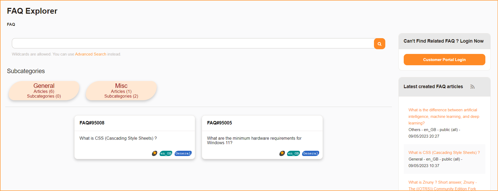

# Znuny-Featured-Card-FAQ
- Display featured FAQ at FAQ main page for public and customer. 
- Introduce card based display instead of table.
- Introduce customer login button at public faq.

	1. Update your existing FAQ by ticking 'Featured FAQ' checkbox.
	2. See customer portal or public portal.
	

		
